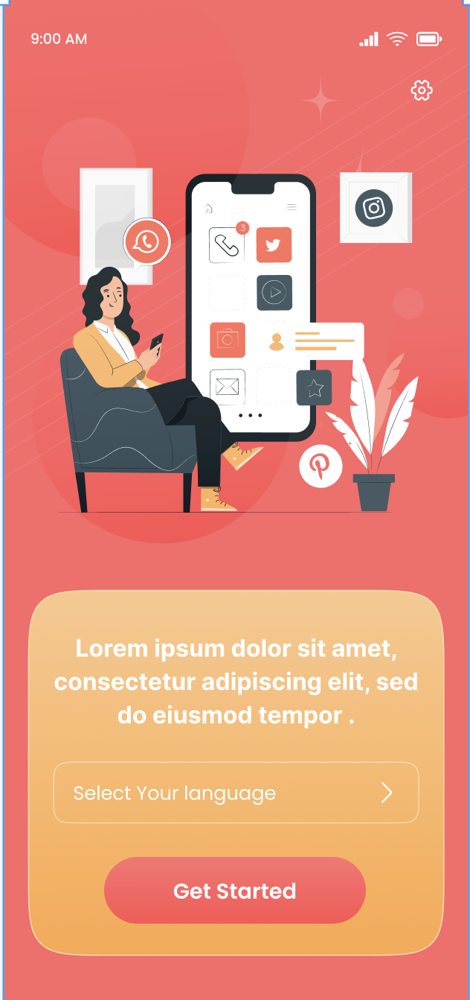
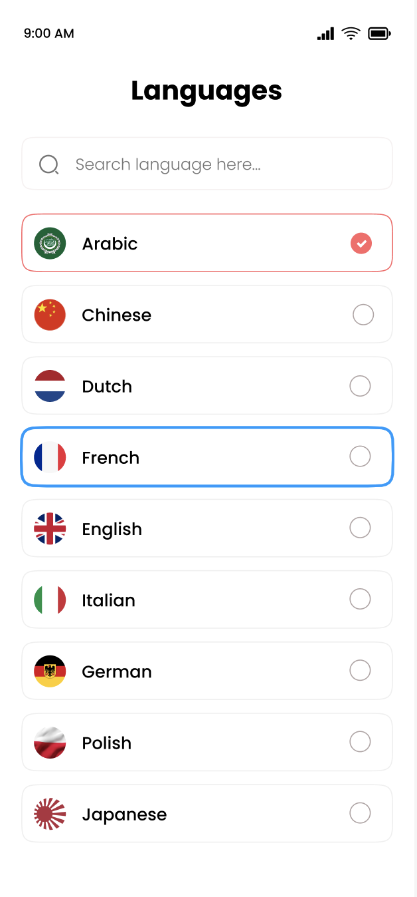
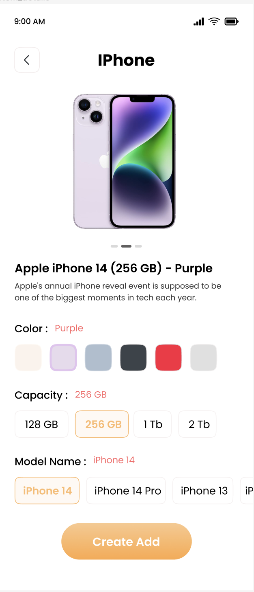
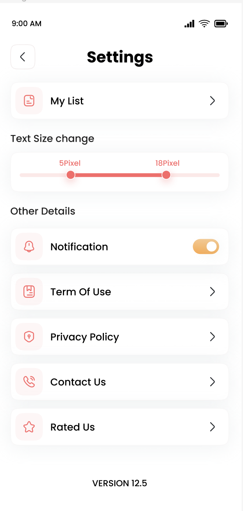
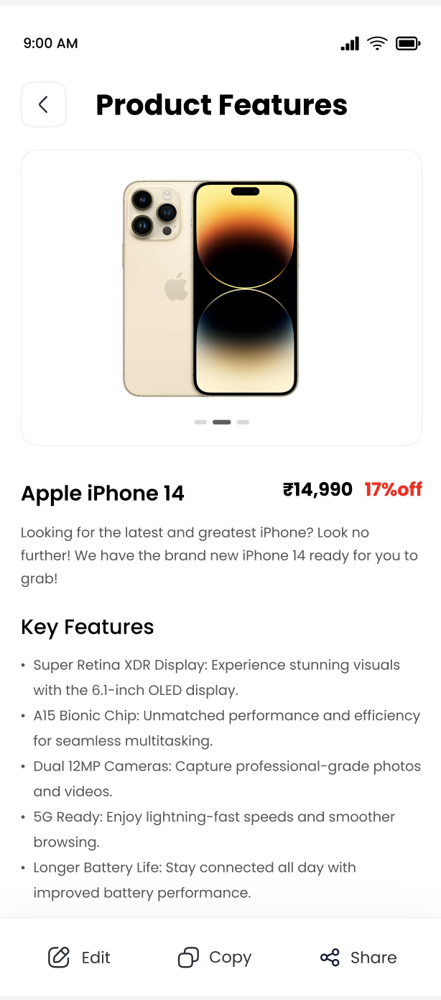

# Content and Image Creations App with ChatGPT-4

Welcome to the Content and Image Creations App – an innovative solution for crafting compelling content and image compositions using the power of ChatGPT-4. This app enables users to input their ad details and enjoy a seamless multi-language content creation experience tailored to the needs of a media app.

## Table of Contents

- [Introduction](#introduction)
- [Getting Started](#getting-started)
  - [Environment Setup](#environment-setup)
  - [Starting the App](#starting-the-app)
- [App Features](#app-features)
  - [Content Creation](#content-creation)
  - [Image Compositions](#image-compositions)
  - [Multi-Language Support](#multi-language-support)
- [Modifying the App](#modifying-the-app)
- [Integration Guide](#integration-guide)
- [Troubleshooting](#troubleshooting)
- [Learn More](#learn-more)

## Introduction

The Content and Image Creations App is designed to provide users with a user-friendly interface to create captivating content and image compositions effortlessly. Leveraging ChatGPT-4, the app enables users to input ad details, generating pixel-perfect designs in multiple languages.

## Getting Started

### Screens 
 

### Environment Setup

Before diving into the app, ensure you have set up your React Native environment. Follow the [React Native - Environment Setup](https://reactnative.dev/docs/environment-setup) instructions up to the "Creating a new application" step.

### Starting the App

1. **Start the Metro Server:**
   Begin by starting Metro, the JavaScript bundler that ships with React Native:
   ```bash
   npm start
   ```
   OR
   ```bash
   yarn start
   ```

2. **Start Your Application:**
   With Metro Bundler running, open a new terminal from the root of your React Native project. Start your Android or iOS app:
   - For Android:
     ```bash
     npm run android
     ```
     OR
     ```bash
     yarn android
     ```
   - For iOS:
     ```bash
     npm run ios
     ```
     OR
     ```bash
     yarn ios
     ```

3. **Modify the App:**
   Open `App.tsx` in your text editor and make edits. For Android, press <kbd>R</kbd> key twice or select "Reload" from the Developer Menu to see changes. For iOS, hit <kbd>Cmd ⌘</kbd> + <kbd>R</kbd> in your iOS Simulator.

## App Features

### Content Creation

Craft engaging content by inputting your ad details. ChatGPT-4 generates creative, contextually relevant content to meet your advertising needs.

### Image Compositions

Design eye-catching image compositions using the app's intuitive interface. Customize visuals, layouts, and styles to create stunning graphics.

### Multi-Language Support

The app provides robust support for multiple languages, ensuring your content creation is not limited by linguistic boundaries.

## Modifying the App

After successfully running the app:

1. Open `App.tsx` in your text editor and make edits.
2. For Android: Press <kbd>R</kbd> key twice or select "Reload" from the Developer Menu to see changes. For iOS: Hit <kbd>Cmd ⌘</kbd> + <kbd>R</kbd> in your iOS Simulator to reload and see changes.

## Integration Guide

If you wish to integrate this React Native code into an existing application, refer to the [Integration guide](https://reactnative.dev/docs/integration-with-existing-apps).

## Troubleshooting

If you encounter issues, consult the [Troubleshooting](https://reactnative.dev/docs/troubleshooting) page.

## Learn More

Explore additional resources to enhance your knowledge:

- [React Native Website](https://reactnative.dev) - Learn more about React Native.
- [Getting Started](https://reactnative.dev/docs/environment-setup) - An overview of React Native and environment setup.
- [Learn the Basics](https://reactnative.dev/docs/getting-started) - A guided tour of React Native basics.
- [Blog](https://reactnative.dev/blog) - Read the latest official React Native blog posts.
- [`@facebook/react-native`](https://github.com/facebook/react-native) - The open-source GitHub repository for React Native.

Enjoy creating compelling content with the Content and Image Creations App! 🚀